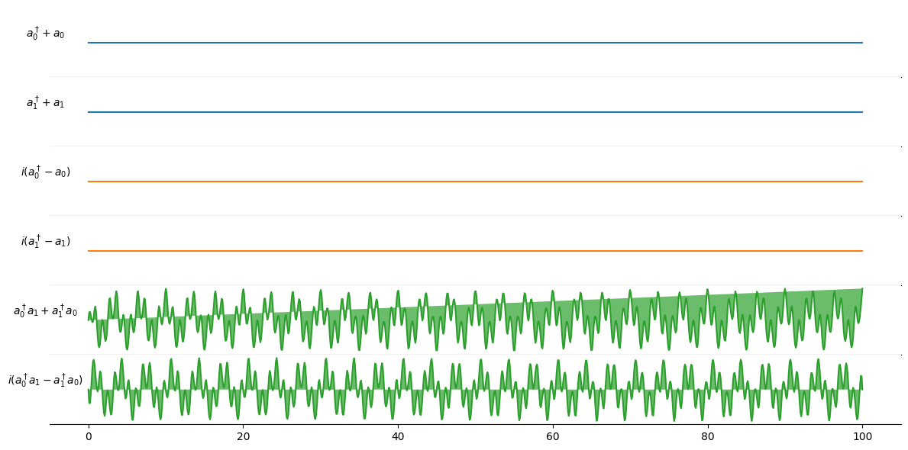

# Multi-qubit gates

A two-qubit gate between two qubits labeled $i$ and $j$ are performed using a time-dependent coupling term of the form 

\begin{equation}
    H_\mathrm{coupling}(t) =  g(t)(a^\dagger_ia_j+a_ia^\dagger_j),
\end{equation}

where the time-dependent coupling term is given by

\begin{equation}
    g(t) = g_0 \cos(\omega_d t + \phi),
\end{equation}

where $\omega_d$ is the driving frequency, and $g_0$ is the amplitude, and $\phi$ is a phase. Since we are working in the rotating frame 

\begin{equation}
U^R(t) = e^{i(\omega_{r_i}a^\dagger_ia_i+\omega_{r_j}a^\dagger_ja_j)t}
\end{equation}

the coupling Hamiltonian in the rotating frame is

\begin{align}
    H^R_\mathrm{coupling}(t) =  g(t)(a^\dagger_ia_je^{i\Delta_{ij}t}+a_ia^\dagger_je^{-i\Delta_{ij}t}),
\end{align}

where $\Delta_{ij} \equiv \omega_{r_i}-\omega_{r_j}$ is the difference in rotating frame frequency between qubit $i$ and $j$. By writing the exponentials on trigonometric form and seperating the real and imaginary part the coupling term can be written as

\begin{align}
    H^R_\mathrm{coupling}(t) =  g(t) \Big[(a^\dagger_ia_j + a_i a_j^\dagger)\cos(\Delta_{ij}t) + i(a^\dagger_ia_j - a_i a_j^\dagger)\sin(\Delta_{ij}t)\Big]
\end{align}

## Example
To perform a CZ-gate between two qubits we do
```py
# Define a circuit and run the simulation
num_qubits = 2
circuit = QubitCircuit(num_qubits)
circuit.add_gate("CZ", controls=0, targets=1)

# Qubit frequencies in (GHz)
qubit_frequencies = [2 * np.pi * 5.0, 2 * np.pi * 5.4]
# Anharmonicity in (GHz)
anharmonicities = [- 2 * np.pi * 0.3, - 2 * np.pi * 0.3]
# T1's and T2's for the qubits in (ns)
t1 = [60 * 1e3, 80 * 1e3]
t2 = [100 * 1e3, 105 * 1e3]

# Time of CZ-gate
t = 100
# corresponding coupling
g = np.sqrt(2) * np.pi / t
# Coupling matrix
coupling_matrix = np.array([[0, g],
                            [0, 0]])

# Load the physical parameters onto the model
model = SarimnerModel(
    qubit_frequencies=qubit_frequencies,
    anharmonicities=anharmonicities,
    coupling_matrix=coupling_matrix,
)

# Choose compiler
compiler = SarimnerCompiler(model=model)

# Create the processor with the given hardware parameters
sarimner = SarimnerProcessor(model=model, compiler=compiler)

tlist, coeffs = sarimner.load_circuit(circuit)

sarimner.plot_pulses(show_axis=True);
```

