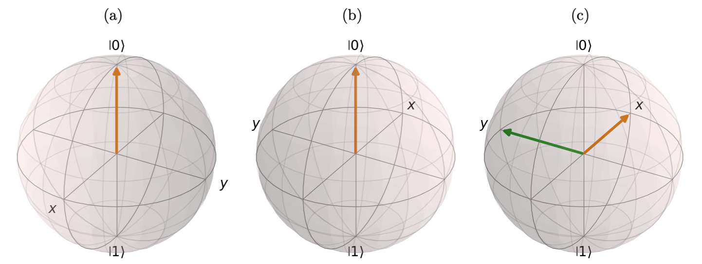
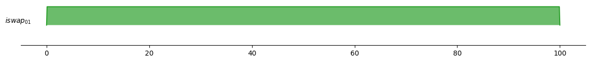
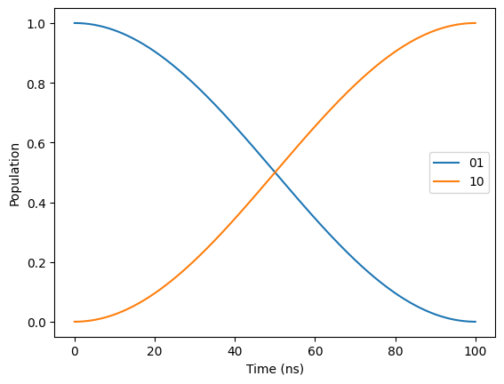

## Single-qubit gates

### Rotational X and Y-gates
On this page we are describing how a single-qubit gate that implements rotation around the $x$- or $y$-axis on the Bloch sphere can be performed.

We consider a driven weakly anharmonic qubit whose Hamiltonian in lab frame can be written as

\begin{equation}
    \label{eq:Transmon}
    \frac{H}{\hbar} = \omega_q a^\dagger a+\frac{\alpha}{2} a^\dagger a^\dagger a a +E(t)a^\dagger+E(t)^*a,
\end{equation}

where $\omega_q\equiv \omega_q^{0\rightarrow 1}$ is the qubit frequency and $\alpha = \omega_q ^{1\rightarrow 2}-\omega_q^{0\rightarrow 1}$ is the anharmonicity. The driving and control is given by

\begin{equation}
    E(t)= \begin{cases} 
        \Omega^x(t)\cos(\omega_d t)+\Omega^y(t)\sin(\omega_d t),& 0<t<t_g, \\ 0, & \text{otherwise}.
    \end{cases}
\end{equation}

Here $\Omega^x(t)$ and $\Omega^y(t)$ are two independent quadrature controls, $t_g$ is the total gate-time, and $\omega_d$ is the drive frequency. Next we move into the rotating frame of the drive by performing the following unitary transformation $U(t)=e^{i\omega_r t a^\dagger a}$, where $\omega_r$ is the rotating frame frequency. The Hamiltonian in the rotating frame after having performed the rotating wave approximation reads

\begin{multline}
    \frac{H^R}{\hbar}=
    \Delta a^\dagger a + \frac{\alpha}{2} a^{\dagger 2}a^2 + 
    (\frac{\Omega^x(t)}{2}\cos([\omega_r-\omega_d]t)-\frac{\Omega^y(t)}{2}\sin([\omega_r-\omega_d]t))(a^\dagger + a) \\
    + (\frac{\Omega^x(t)}{2}\sin([\omega_r-\omega_d]t)+\frac{\Omega^y(t)}{2}\cos([\omega_r-\omega_d]t))(ia^\dagger - ia),
\end{multline}

where $\Delta \equiv \omega_q - \omega_r$ is the qubit detuning. 

As a concrete example, assume that we apply a pulse at the qubit frequency $\omega_d=\omega_q$, and choose the rotating frame of the drive $\omega_r=\omega_d$. Then,

\begin{equation}
    \frac{H^R}{\hbar} =
    \frac{\alpha}{2} a^{\dagger 2}a^2
    + \frac{\Omega^x(t)}{2}(a^\dagger + a)
    + \frac{\Omega^y(t)}{2}(ia^\dagger - ia).
\end{equation}

If we treat the Hamiltonian as an effective two level system (ignoring the anharmonic term) and make the replacement $(a^\dagger + a)\rightarrow \sigma_x$ and $(ia^\dagger-ia)\rightarrow \sigma_y$, we obtain

\begin{equation}
    \frac{H^R}{\hbar} = \frac{\Omega^x(t)}{2}\sigma_x + \frac{\Omega^y(t)}{2}\sigma_y,
\end{equation}

showing that an in-phase pulse (i.e. the $\Omega^x(t)$ quadrature component) corresponds to a rotation around the $x$-axis while the out-of-phase pulse (i.e. the $\Omega^y(t)$ quadrature component), corresponds to rotations about the $y$-axis. As a concrete example of an in-phase pulse, writing out the unitary evolution operator yields,

\begin{equation}
    U^R(t)=\exp([-\frac{i}{2}\int_0^t\Omega^x(t')\mathrm{d}t']\sigma_x).
\end{equation}

By defining the angle

\begin{equation}
    \Theta(t)=\int_0^t\Omega^x(t')\mathrm{d}t',
\end{equation}

which is the angle a state is rotated given a waveform envelope $\Omega^x(t)$. This means that to implement a $\pi$-pulse on the $x$-axis one would solve $\Theta(t)=\pi$ and output the signal in-phase with the qubit drive. Typically $\Omega^x(t)$ is choosen as a gaussian pulse

\begin{equation}
     \Omega^x(t) = B e^{-\frac{(t-t_g/2)^2}{2\sigma^2}}
\end{equation}

In this simple example we assumed that we could ignore the higher levels of the qubit. In general leakage errors which take the qubit out of the computational subspace as well as phase errors can occur. To combat theses errors the so-called DRAG[@motzoi2009simple] procedure (Derivative Reduction by Adiabatic Gate) is used. In doing so we apply an extra signal in the out-of-phase component, such that

\begin{align}
    \Omega^x(t) = B e^{-\frac{(t-t_g/2)^2}{2\sigma^2}},\quad
    \Omega^y(t) = q\sigma\frac{d\Omega^x(t)}{dt}
\end{align}

where $q$ is a scale parameter that needs to be optimized with respect to a $\pi/2$-pulse. Interchanging $\Omega^x(t)$ and $\Omega^y(t)$ in the equation above corresponds to DRAG pulsing the $\Omega^y(t)$ component. The amplitude $B$ is fixed such that

\begin{equation}
    \Big|\int_{0}^{t}[\Omega^x(t')+i\Omega^y(t')]\mathrm{d}t'\Big|=\pi.
\end{equation}

for a $\pi$-pulse with DRAG.

#### Example: X-rotation with DRAG
The following example shows how an $R_X(\pi/2)$-gate is implemented on the `Sarimner` using drag.

```py
import numpy as np
import matplotlib.pyplot as plt
from qutip_qip.circuit import QubitCircuit
from chalmers_qubit.sarimner import (
    SarimnerProcessor, SarimnerModel, SarimnerCompiler
)

# Create circuit with a single RX-gate
circuit = QubitCircuit(1)
circuit.add_gate("RX", targets=0, arg_value=np.pi/2)

# Qubit frequencies in (GHz)
transmon_dict = {
    0: {"frequency": 5.0, "anharmonicity": -0.30},
}

# Load the physical parameters onto the model
model = SarimnerModel(transmon_dict=transmon_dict)

# Choose compiler
compiler = SarimnerCompiler(model=model)

# Create the processor with the given hardware parameters
sarimner = SarimnerProcessor(model=model, compiler=compiler)

# Load circuit
tlist, coeffs = sarimner.load_circuit(circuit)

# Plot pulses
fig, axis = sarimner.plot_pulses(show_axis=True)
plt.xlabel("Time (ns)")
```


Currently only Gaussian pulses are available for single-qubit gates, but cosine pulses are soon going to be implemented as well. To configure the Gaussian pulse, such as, amplitude, standard deviation, and gate-time, the following options can be suppied to the `SarimnerCompiler`

```py
# Options for compiler
options = {
    "dt": 0.1, # time-step of simulator in (ns)
    "single_qubit_gate": { # the following are the default values
        "type": "gaussian",
        "gate_time": 50, # in (ns)
        "amplitude": 0.12533148558448476,
        "std": 5,  # in (ns)
    },
}
compiler = SarimnerCompiler(options=options)
```

### Virtual Z-gate
To implement the $R_Z(\theta)$-gate, we include a phase $\phi$ to our drive

\begin{equation}
    E(t)= \begin{cases}
        \Omega^x(t)\cos(\omega_d t + \phi)+\Omega^y(t)\sin(\omega_d t + \phi),& 0<t<t_g, \\ 0, & \text{otherwise}.
    \end{cases}
\end{equation}

Upon initialization, all qubit drives are initialized with a phase of $\phi=0$. Now, when a $R_Z(\theta)$-gate is performed we simply update the phase of the corresponding qubit drive, such that $\phi$ shifts to $-\theta$. The minus sign here signifies that we do a rotation of the Bloch sphere rather than the state itself.

**Note:** If a $R_Z(\phi)$-gate is performed at the end of a quantum circuit, this gate will not have any effect on the quantum state.

#### Example: Hadamard Gate Decomposition and Phase Correction

The Hadamard gate ($H$) can be decomposed into a sequence of rotations: a $\pi$ rotation around the Z-axis followed by a $\pi/2$ rotation around the Y-axis. Mathematically, this is expressed as $H = iR_Y(\pi/2)R_Z(\pi)$, where $i$ is a global phase factor. Notably, this decomposition allows for implementing the Hadamard gate using only one physical gate.

The following example simulates the Hadamard gate applied to the initial state $\ket{0}$.

```py
import numpy as np
import matplotlib.pyplot as plt
from qutip_qip.circuit import QubitCircuit
from chalmers_qubit.sarimner import (
    SarimnerProcessor, SarimnerModel, SarimnerCompiler
)

# Create circuit with a single Hadamard-gate
circuit = QubitCircuit(1)
circuit.add_gate("H", targets=0)

# Qubit frequencies in (GHz)
transmon_dict = {
    0: {"frequency": 5.0, "anharmonicity": -0.30},
}

# Load the physical parameters onto the model
model = SarimnerModel(transmon_dict=transmon_dict)

# Choose compiler
compiler = SarimnerCompiler(model=model)

# Create the processor with the given hardware parameters
sarimner = SarimnerProcessor(model=model, compiler=compiler)

# Load circuit
tlist, coeffs = sarimner.load_circuit(circuit)

# Prepare initial state and run simulation
init_state = basis(3, 0)
result = sarimner.run_state(init_state)
final_state = project_on_qubit(result.states[-1])
print(final_state)
```

While the intended operation is to transform $\ket{0}$ to the equal superposition state $\ket{+}=(\ket{0}+\ket{1})/\sqrt{2}$, the simulation initially yields $\ket{-}=(\ket{0}-\ket{1})/\sqrt{2}$. This difference arises because the $R_Z(\pi)$ gate performs a virtual rotation on the Bloch sphere. This is illustrated in the figure below, where figure (a) shows the initial state $\ket{0}$. (b) shows the virtually rotated Bloch sphere after the $R_Z(\pi)$-gate, and (c) shows the final-state after the $R_Y(\pi/2)$-rotation with the green arrow showing the direction of the drive. 



The state is however unaffected by this virtual rotation of the Bloch sphere. Therefore, to obtain the correct phase factor of our state, we can use the `phase` attribute of the `compiler` class. This attribute holds the phase corrections for all qubits, i.e. how much we have rotated the Bloch sphere for each qubit. As such, applying a rotation gate (`rz`) with this phase to the final state will yeild a state with the correct phase.

```python
from qutip_qip.operations.gates import rz

# Extract phase correction from the compiler
phase = compiler.phase
# Apply phase correction to the final state
phase_corrected_state = rz(phase[0]) * final_state
print(phase_corrected_state)
```

## Multi-qubit gates

### ISWAP-gate
The ISWAP-gate between two qubits are performed using a time-dependent coupling term of the form 

\begin{equation}
    \frac{H_\mathrm{coupling}(t)}{\hbar} =  g(t)(\ket{10}\bra{01}+\ket{01}\bra{10}),
\end{equation}

where the time-dependent coupling term $g(t)$ is given by a step-function with amplitude $g$ and sinusodial rise-and-fall time. The gate time for the ISWAP-gate is dependent on the coupling strength $g$ as:

\begin{equation}
    t_\mathrm{gate} = \frac{1}{4g}
\end{equation}

#### Example
To following example shows the execution of a ISWAP-gate.
```py
# Define a circuit and run the simulation
num_qubits = 2
circuit = QubitCircuit(num_qubits)
circuit.add_gate("ISWAP", controls=0, targets=1)

# Qubit frequencies in (GHz)
transmon_dict = {
    0: {"frequency": 5.0, "anharmonicity": -0.30},
    1: {"frequency": 5.4, "anharmonicity": -0.30},
}
# Time of ISWAP-gate in (ns)
t = 100
# Calculate corresponding coupling strength
g = 1 / (4 * t)
coupling_dict = {
    (0, 1): g,
}

# Load the physical parameters onto the model
model = SarimnerModel(transmon_dict=transmon_dict, coupling_dict=coupling_dict)

# Choose compiler
compiler = SarimnerCompiler(model=model)

# Create the processor with the given hardware parameters
sarimner = SarimnerProcessor(model=model, compiler=compiler)

tlist, coeffs = sarimner.load_circuit(circuit)

sarimner.plot_pulses(show_axis=True);
```


To see that the ISWAP-gate is implemented correctly we will now simulate the circuit using the master equation simulation and look at the expectation values of the $|01\rangle$ and $|10\rangle$ states.

```py
ket01 = tensor(basis(3,0), basis(3,1))
ket10 = tensor(basis(3,1), basis(3,0))
# List of operators we wanna compute the expectation value for during the simulation
e_ops = [ket2dm(ket01), ket2dm(ket10)]
result = sarimner.run_state(ket01, e_ops=e_ops)
```

and then plot the results

```py
import matplotlib.pyplot as plt
plt.plot(result.times, result.expect[0], label="01")
plt.plot(result.times, result.expect[1], label="10")
plt.xlabel('Time (ns)')
plt.ylabel('Population')
plt.legend()
```



The pulse $g(t)$ can moreover be configured to include a rise-and-fall time as well as a buffer time. To include this we can supply options to the `SarimnerCompiler`

```py
# Define a circuit and run the simulation
num_qubits = 2
circuit = QubitCircuit(num_qubits)
circuit.add_gate("ISWAP", controls=0, targets=1)

# Qubit frequencies in (GHz)
transmon_dict = {
    0: {"frequency": 5.0, "anharmonicity": -0.30},
    1: {"frequency": 5.4, "anharmonicity": -0.30},
}
# Time of ISWAP-gate in (ns)
t = 100
# Calculate corresponding coupling strength
g = 1 / (4 * t)
coupling_dict = {
    (0, 1): g,
}

# Load the physical parameters onto the model
model = SarimnerModel(transmon_dict=transmon_dict, coupling_dict=coupling_dict)

# Options for compiler
options = {
    "two_qubit_gate": {
        "buffer_time": 5, # in (ns)
        "rise_fall_time": 10, # in (ns)
    },
}

# Choose compiler
compiler = SarimnerCompiler(model=model, options=options)

# Create the processor with the given hardware parameters
sarimner = SarimnerProcessor(model=model, compiler=compiler)

tlist, coeffs = sarimner.load_circuit(circuit)

sarimner.plot_pulses(show_axis=True);
```


### CZ-gate
The CZ-gate between two qubits are performed using a time-dependent coupling term of the form 

\begin{equation}
    \frac{H_\mathrm{coupling}(t)}{\hbar} =  g(t)(\ket{20}\bra{11}+\ket{11}\bra{20}).
\end{equation}

where the time-dependent coupling term $g(t)$ is given by a step-function with amplitude $g$ and sinusodial rise-and-fall time. The gate time is in this case given by

\begin{equation}
    t_\mathrm{gate} = \frac{1}{\sqrt{2}2g}.
\end{equation}
